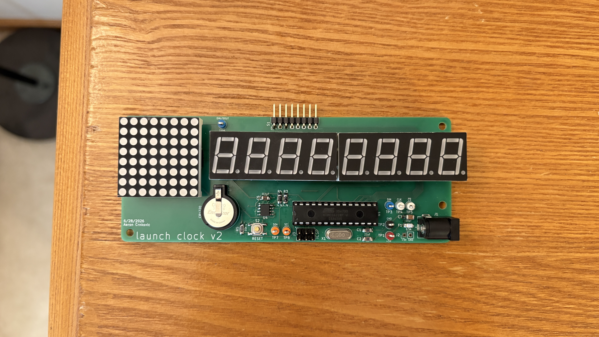
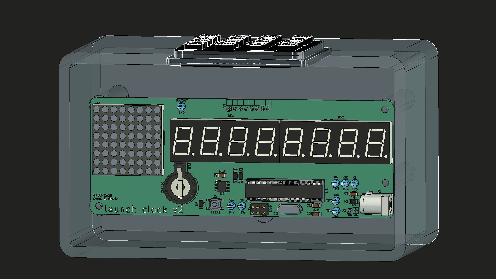
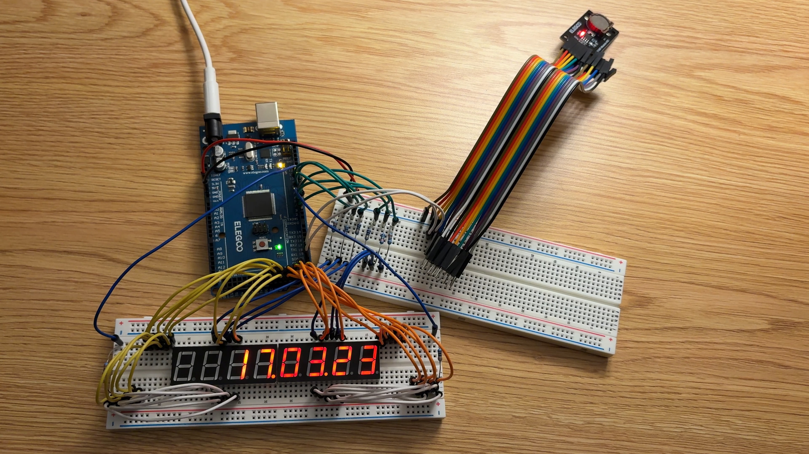
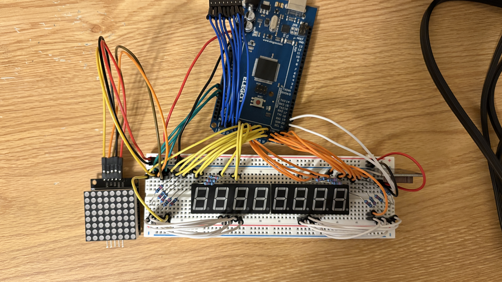
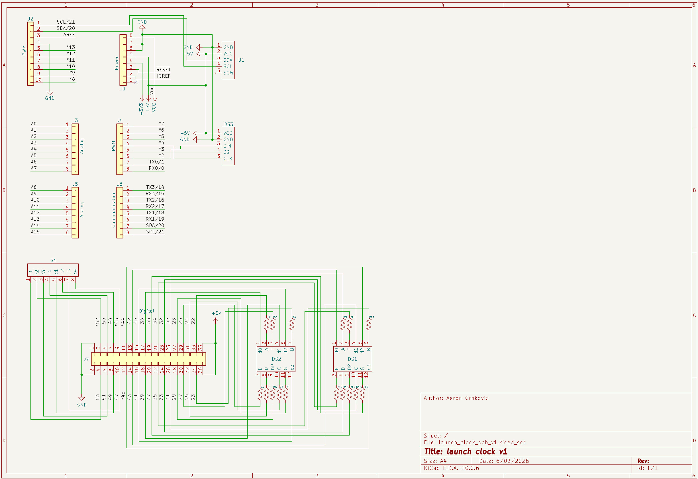
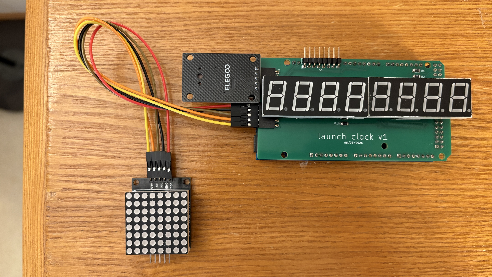
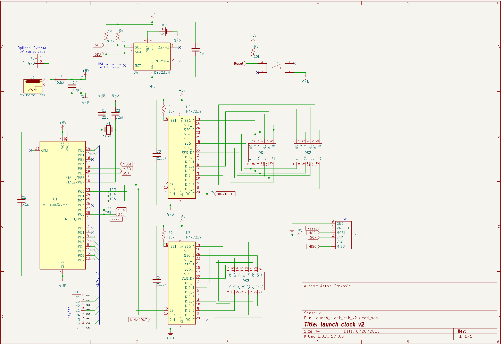
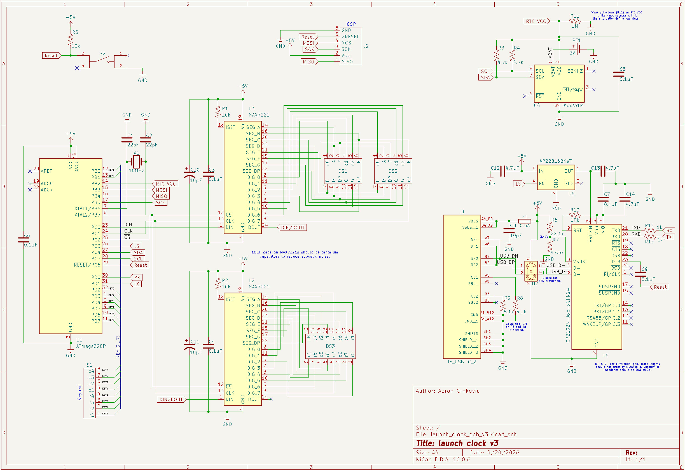
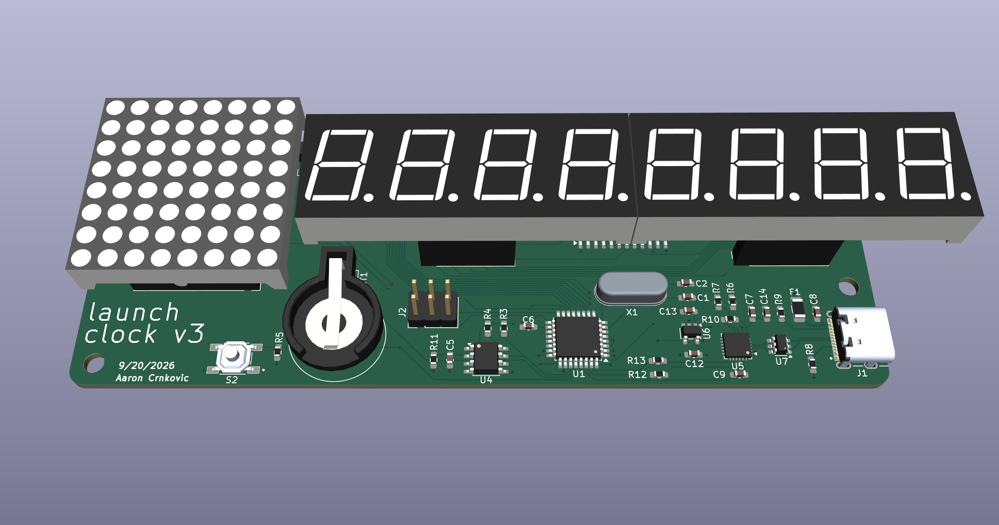

# Rocket Launch Countdown Clock
A standalone digital countdown clock for rocket launches.
It displays countdown and mission elapsed time, is controlled entirely using a keypad, and requires no external computer or network.
It is built around an ATmega328P microcontroller, DS3231 real-time clock, and MAX7219-driven 7-segment and dot matrix displays.

## Features
- LED Displays: 7-segment for time and dot matrix for mode/status glyphs
- Fully keypad-driven UI
- Launch and current time/date setting (including launch date nudging)
- Countdown pausing
- Low-power sleep mode
- Display brightness control
- Configurable countdown time display format
- Error handling including invalid inputs and RTC power loss

## Hardware
Custom PCB designed in KiCad around an ATmega328P microcontroller.

Key components: 
- **MCU**: ATmega328P
- **RTC**: DS3231M with CR1220 battery backup
- **Displays**: MAX7219-driven dual 4-digit 7-segment (5641AS) and 8x8 dot matrix (1088AS)
- **Input**: 4x4 matrix keypad
- **Power**: 5V DC via 5.5x2.1mm barrel jack (or solder pads to enclosure-mounted barrel jack)
- **Communication**: I²C (RTC) and SPI (display drivers & ISP)
- **Assembly**: Hand soldered; uses both THD and SMD components
- **Enclosure**: Custom 3D printed FreeCAD enclosure is WIP

KiCad schematic and PCB files are under the 'hardware/' directory. Assorted photos can be found under the 'assets/' directory.

Status: Version 2 is completed and functional. Version 3 is WIP.

## Firmware
Written in Arduino C++ (AVR) for the ATmega328P (Arduino Uno).

The firmware implements a keypad-driven state machine that manages countdown/MET display, time/date setting, pause, brightness, sleep, and error handling.

Key elements:

- **Libraries**: RTClib (DS3231), Keypad, LedControl (MAX7219), EEPROM, plus AVR sleep/power utilities
- **Architecture**: Event-driven keypad handling and periodic 1-second time updates; use of mode flags for UI states
- **Displays**: Dual MAX7219 display control with PROGMEM bitmaps
- **Persistence**: Launch time/date stored in EEPROM
- **Power**: Full power-down sleep mode woken by keypad pin-change interrupt
- **Robustness**: Input validation, RTC power-loss detection, and dedicated error states

Source is a single sketch organized into functional blocks (display, input, timekeeping, power, UI modes). Programming is performed via the board's ISP header.

## Development History
### Initial Prototype
This Arduino breadboard prototype was an MVP with the singular goal of counting down to the Artemis II launch, with all work being completed entirely the day prior. It has the 7-segment displays wired directly to an Arduino Mega, uses a DS1307 RTC breakout board, and lacks any inputs.

### Revised Prototype
This revised prototype contains around a month of additions and improvements to the initial prototype. These include the addition of keypad inputs (out of frame), a dot matrix display, and corrected/improved display wiring. The vast majority of the time since the initial prototype was spent programming the firmware.

### Version 1 PCB
This custom 2-layer PCB mounts directly to an Arduino Mega using header pins, and the 7-segment displays mount to the board. With exception to the SMD resistors, there are essentially no changes to the circuit or its components between the revised prototype and the version 1 board. The main goal of this design was to become familiar with KiCad and PCB design.

### Version 2 PCB
The main goal of this version was to eliminate the Arduino and breakout boards by integrating all necessary functionality onto the board itself. This includes driving the 7-segment displays with a MAX7219 in the same manner as the dot matrix to allow the use of an MCU that is easier to solder by hand (instead of the ATmega2560 used on the Arduino Mega). The board is still 2-layers, programming is done via the ISP header, and numerous test points were integrated for troubleshooting and experimentation.

### Version 3 PCB (Work in Progress)
In this version, the barrel jack is superseded by a USB-C port with power and USB 2.0 data functionality. The MCU and display drivers use surface-mount packages in favor of through holes and most passive components are downsized to 0603 parts compared to the 1206 parts on version 2, allowing the total board area to be reduced by 28% compared to version 2. The board was designed to reduce EMI (mainly radiated), which includes switching to a 4-layer board. The revision also addresses numerous smaller issues with the version 2 board, including a soft but audible whine.

